# Igor Dinuzzi's Developer Portfolio

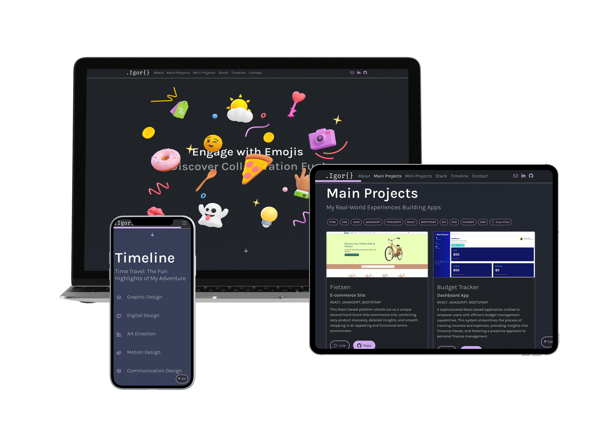

Welcome to my developer portfolio! This project is a culmination of my skills, projects, and experiences as a web developer, showcasing a dynamic and interactive web presence built with React. It's designed to highlight my journey in web development, emphasizing creativity, technical prowess, and a keen eye for design.
[Live](https://igordinuzzi.github.io/portfolio-react/)
[Watch video](https://youtu.be/tU5_63tMvvM)

---

## Table of Contents
[Features](#features)
   - [Responsive Design](#responsive-design)
   - [Dynamic & Interactive Elements](#dynamic--interactive-elements)
   - [Enhanced Accessibility](#enhanced-accessibility)
   - [Smooth Scrolling & Navigation](#smooth-scrolling--navigation)
   - [Comprehensive Project Showcases](#comprehensive-project-showcases)
[Component Overview](#component-overview)
   - [Header](#header)
   - [Hero Section](#hero-section)
   - [About Me](#about-me)
   - [Main Projects](#main-projects)
   - [Mini Projects](#mini-projects)
   - [Stack](#stack)
   - [Timeline](#timeline)
   - [Contact](#contact)
[Designs](#Designs)
[Conclusion](#conclusion)


## Features

### Responsive Design
The portfolio is fully responsive, ensuring that content is beautifully displayed across all devices. Utilizing Bootstrap and custom CSS, the layout adapts to screen sizes from mobile devices to large desktop monitors, offering an optimal browsing experience for every visitor.
```
<Col key={project.id} xs={12} md={colSize} lg={colSize}>
                <Card className="h-100 card-custom">
                <a href={project.liveUrl} target="_blank" rel="noopener noreferrer">
                <Card.Img variant="top" src={project.imageUrl} className="card-img-custom" />
              </a>
```
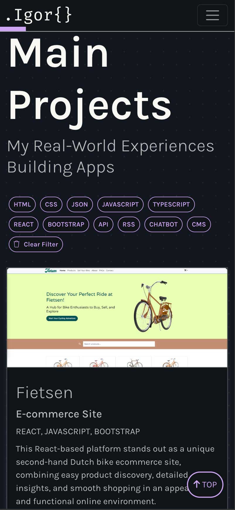

### Dynamic & Interactive Elements
Powered by React, the portfolio features dynamic and interactive elements that engage visitors. From animated text to interactive project cards, every piece is designed to capture attention and showcase my capabilities in creating lively web experiences.
```
const triggerConfetti = () => {
        confetti({
            zIndex: 999,
            particleCount: 100,
            spread: 70,
            origin: { y: 0.6 },
        });
    };
    
  // Splitting the heading into letters for animation
  const heading = "Main Projects";
  const headingLetters = Array.from(heading);

  const containerVariants = {
    visible: {
      transition: {
        staggerChildren: 0.5,
      },
    },
  };

  const letterVariants = {
    hidden: { opacity: 0, y: 20 },
    visible: { opacity: 1, y: 0 },
  };
```

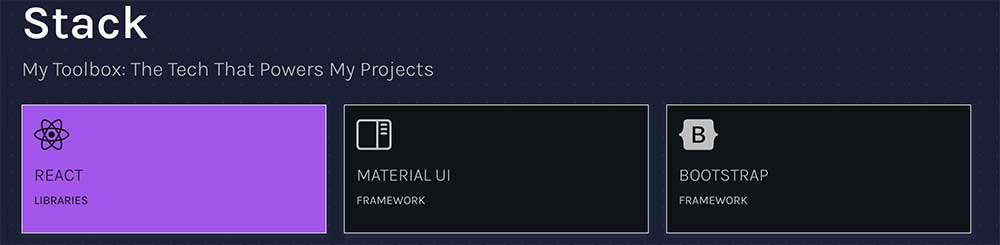

### Enhanced Accessibility
Accessibility is a priority, with careful attention to ARIA labels and keyboard navigation. This ensures that the portfolio is user-friendly for everyone, including those using assistive technologies.
```
<Link to="about" spy={true} smooth={true} offset={-70} duration={500} className="nav-link" aria-label="About">About</Link>
```

### Smooth Scrolling & Navigation
Utilizing React Scroll, the portfolio offers smooth scrolling navigation, allowing users to easily explore sections such as About Me, Projects, and Contact Information. This seamless navigation enhances the overall user experience.
```
    // Scroll to top on button click
    const scrollToTop = () => {
        window.scrollTo({
            top: 0,
            behavior: 'smooth',
        });
    };

```

### Comprehensive Project Showcases
Projects are the heart of this portfolio, divided into Main Projects and Mini Projects sections. Each project card includes detailed descriptions, technology tags, and links to live demos and source code, offering a deep dive into my work and processes.
```
export interface Project {
  id: number;
  title: string;
  subtitle: string;
  description: string;
  tags: string[];
  imageUrl: string;
  alt?: string;
  liveUrl: string; // URL to the live project
  repoUrl: string; // URL to the project's repository
}
```
```
const projectsData: Project[] = [
    {
      id: 1,
      title: 'Fietsen',
      subtitle: 'E-commerce Site',
      description: 'This React-based platform stands out as a unique second-hand Dutch bike ecommerce site, combining easy product discovery, detailed insights, and smooth shopping in an appealing and functional online environment. ',
      tags: ['REACT', 'JAVASCRIPT', 'BOOTSTRAP'],
      imageUrl: `${process.env.PUBLIC_URL}/images/main-projects/fietsen.jpg`,
      alt: 'Second-hand Dutch bikes ecommerce', 
      liveUrl: 'https://igordinuzzi.github.io/ecommerce-site-react/',
      repoUrl: 'https://github.com/igordinuzzi/ecommerce-site-react',
    },
```
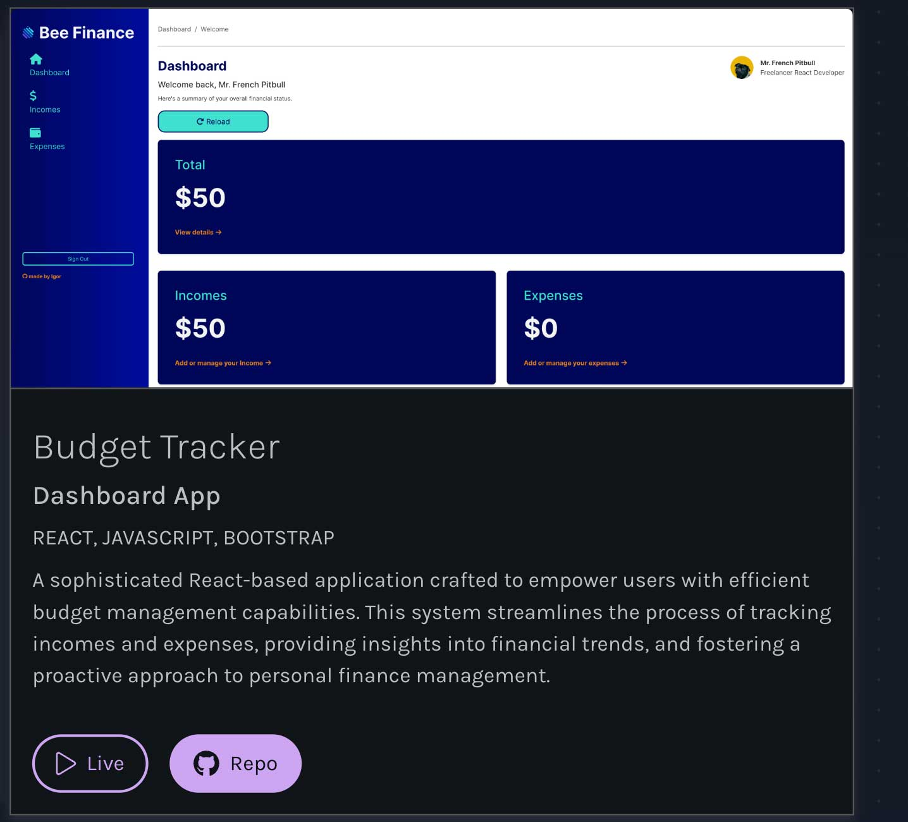

## Component Overview

### Header
The Header component sets the tone for the portfolio, featuring a custom navbar that sticks to the top for easy access. It includes links to different sections of the portfolio, ensuring that navigation is straightforward and intuitive. The integration of FontAwesome icons adds a visual touch to the contact options, linking to email, LinkedIn, and GitHub profiles.
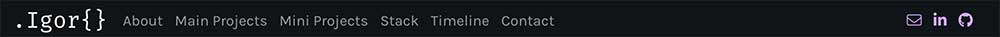

### Hero Section
The Hero section greets visitors with engaging animations and a brief introduction to the portfolio's theme, "Engage with Emojis, Discover Collaboration Fun!" It uses Spline to embed 3D designs, adding an innovative layer to the presentation.
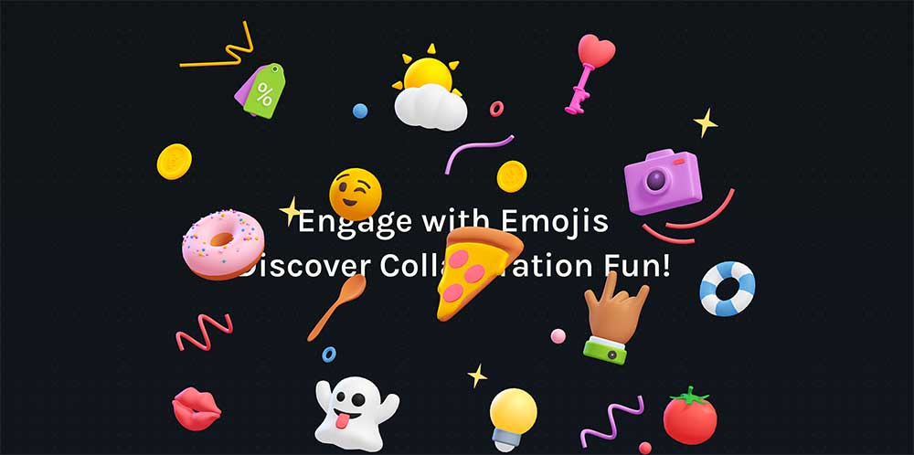

### About Me
This section tells my story, from my background in UX design to my journey into web development. It highlights my skills, motivations, and the unique perspective I bring to my projects. The inclusion of animated text and a professional photo personalizes the experience, inviting visitors to learn more about me.
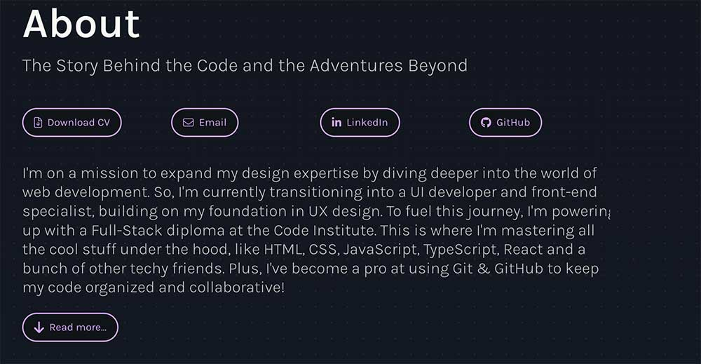

### Main Projects
Focusing on significant undertakings, the Main Projects section showcases my most impactful work. It provides insights into each project's scope, technologies used, and the challenges overcome. This section is dynamic, allowing users to filter projects based on technology tags, and features custom animations for added interactivity.
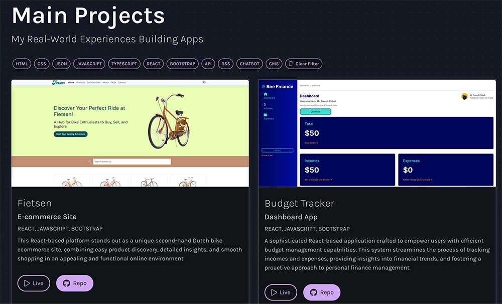

### Mini Projects
The Mini Projects section highlights smaller, yet no less important, projects that have allowed me to experiment with new technologies and concepts. It serves as a testament to my constant learning and growth in the field of web development.
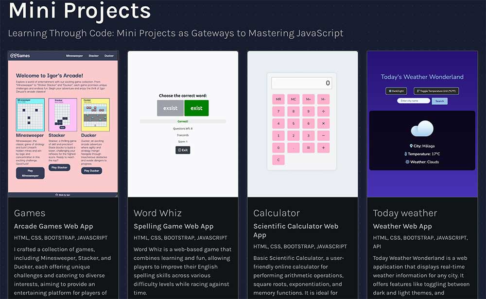

### Stack
In the Stack section, I outline the technologies, libraries, and tools that I use. It's divided by categories such as Languages, Frameworks, and CMS, showcasing my versatile skill set and familiarity with both front-end and back-end technologies.
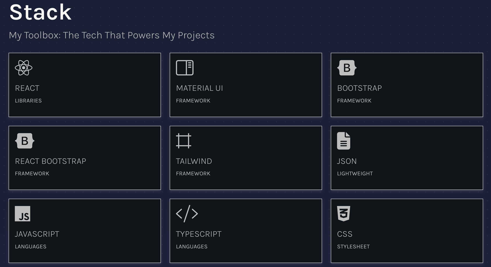

### Timeline
The Timeline section offers a chronological look at my professional journey and achievements. Using motion design, it visually represents my progression from graphic design to front-end development, highlighting key milestones and skills acquired along the way.
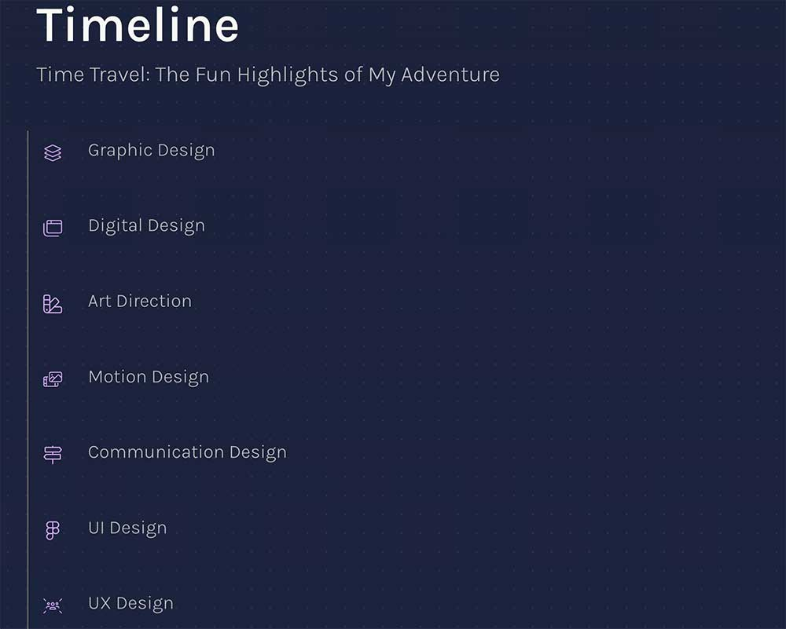

### Contact
Lastly, the Contact section provides a direct line to reach out to me. It includes my email and phone number, as well as links to my LinkedIn and GitHub profiles, encouraging potential collaborations or inquiries.
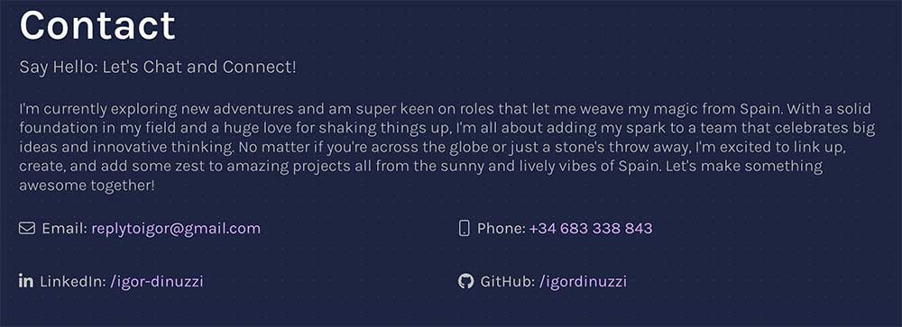

## Designs

The design and logo of this portfolio are a reflection of my, Igor Dinuzzi's, dedication to detail and my enthusiasm for creative expression. Developed using Figma, these components are more than just visual elements; they encapsulate my transition from a designer to a developer. My selection of colors, typefaces, and the overall layout illustrates a seamless fusion of beauty and practicality, mirroring the core values that drive my professional endeavors. The logo, in particular, serves as a distinctive mark of my digital presence, representing both the innovative spirit and the personalized approach I apply to every project. Embarking on this design journey with Figma highlights my versatile capabilities, demonstrating my adeptness at creating compelling user experiences from scratch for my portfolio.

```
@import url('https://fonts.googleapis.com/css2?family=Karla:ital,wght@0,200;0,300;0,400;0,500;0,600;0,700;0,800;1,200;1,300;1,400;1,500;1,600;1,700;1,800&display=swap');

:root {
  --primary-color: #CDA6F2;
  --primary-hover: #A255EB;
  --background-color: #101418;
  --text-color: #bebebe;
  --button-active: #CDA6F2;
  --button-hover: #A255EB;
  --card-border: #5C5C5C;
  --warning-color: #FF6E6E;
  --font-size-h1: 4em;
  --font-size-h2: 1.75em;
  --font-size-h3: 1.5em;
  --font-size-h4: 1.25em;
  --font-size-p: 1em;
  --font-size-smaller: 0.875em;
  --line-height-h1: 1.2;
  --line-height-h2: 1.3;
  --line-height-h3: 1.4;
  --line-height-h4: 1.4;
  --line-height-p: 1.5;
  --line-height-smaller: 1.5;
  --color-light: #F8F8F2;
}
```
### Low-fi Wireframes
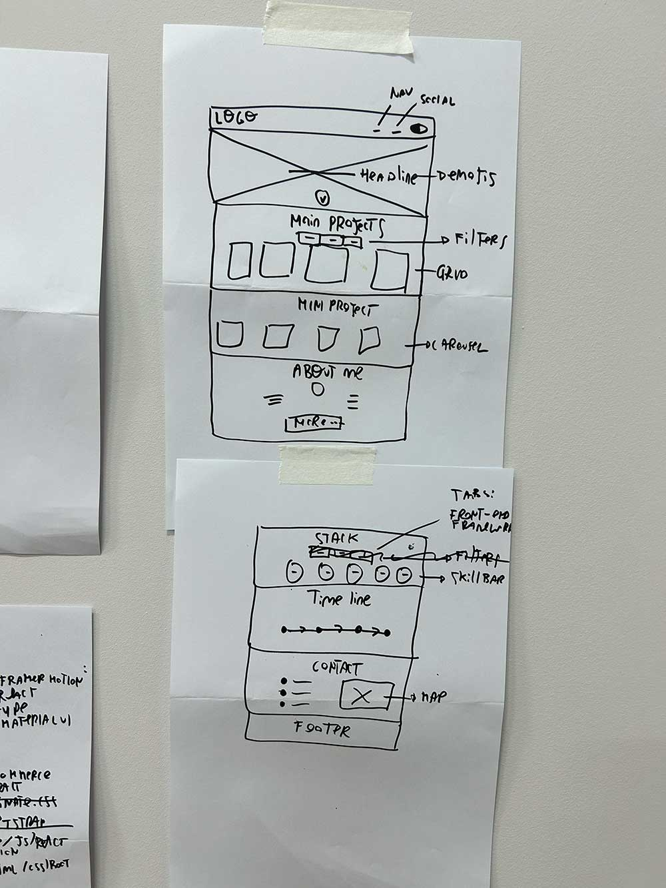

### Mid-fi Wireframes
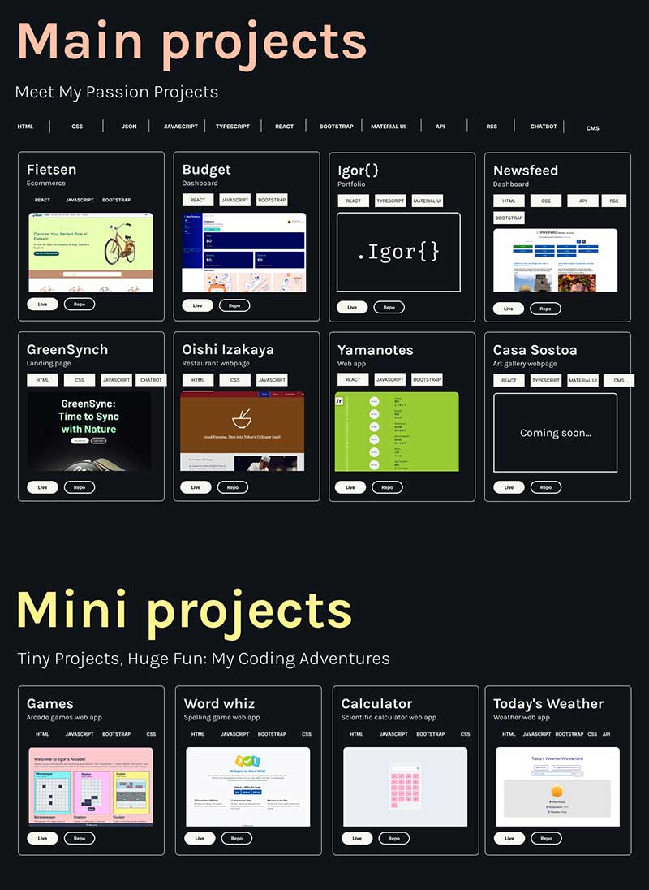

### Logo
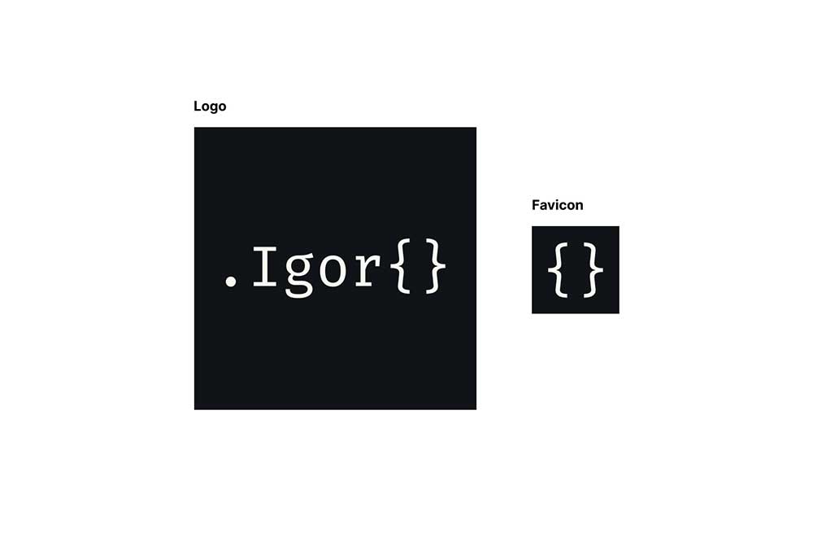

### Design System
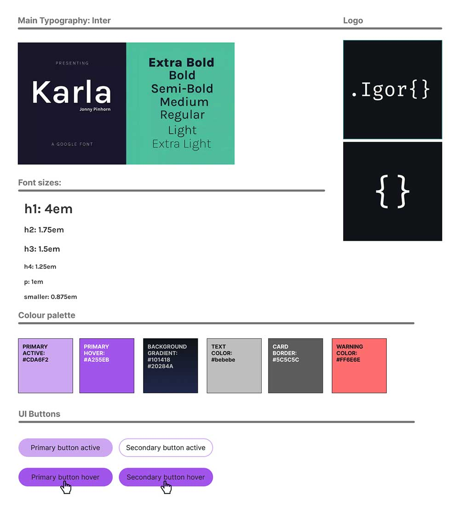

## Conclusion

My developer portfolio is a living representation of my journey, skills, and aspirations in web development. It reflects my dedication to crafting meaningful and accessible web experiences, my passion for continuous learning, and my commitment to excellence. Thank you for visiting, and I look forward to connecting with you!

# Getting Started with Create React App

This project was bootstrapped with [Create React App](https://github.com/facebook/create-react-app).

## Available Scripts

In the project directory, you can run:

### `npm start`

Runs the app in the development mode.\
Open [http://localhost:3000](http://localhost:3000) to view it in the browser.

The page will reload if you make edits.\
You will also see any lint errors in the console.

### `npm test`

Launches the test runner in the interactive watch mode.\
See the section about [running tests](https://facebook.github.io/create-react-app/docs/running-tests) for more information.

### `npm run build`

Builds the app for production to the `build` folder.\
It correctly bundles React in production mode and optimizes the build for the best performance.

The build is minified and the filenames include the hashes.\
Your app is ready to be deployed!

See the section about [deployment](https://facebook.github.io/create-react-app/docs/deployment) for more information.

### `npm run eject`

**Note: this is a one-way operation. Once you `eject`, you can’t go back!**

If you aren’t satisfied with the build tool and configuration choices, you can `eject` at any time. This command will remove the single build dependency from your project.

Instead, it will copy all the configuration files and the transitive dependencies (webpack, Babel, ESLint, etc) right into your project so you have full control over them. All of the commands except `eject` will still work, but they will point to the copied scripts so you can tweak them. At this point you’re on your own.

You don’t have to ever use `eject`. The curated feature set is suitable for small and middle deployments, and you shouldn’t feel obligated to use this feature. However we understand that this tool wouldn’t be useful if you couldn’t customize it when you are ready for it.

## Learn More

You can learn more in the [Create React App documentation](https://facebook.github.io/create-react-app/docs/getting-started).

To learn React, check out the [React documentation](https://reactjs.org/).
